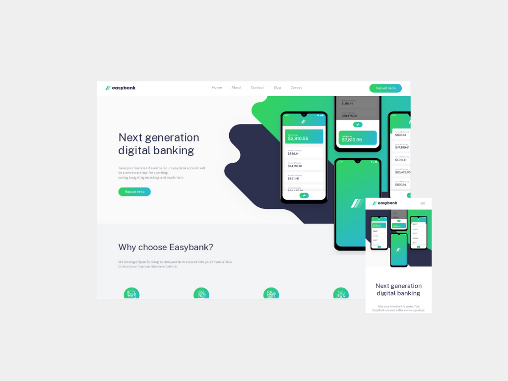

# Easy Bank

##### Landing page responsiva Desenvolvida no desafio da plataforma Frontend Mentor

Este projeto é resultado de um desafio da plataforma Front end Mentor cujo objetivo do desafio era desenvolver uma landing page responsiva de um banco digital

## Tecnologias utilizadas

- HTML5
- CSS FlexBox Layout
- CSS Media Queries
- JavaScript
- Gulp
- Sass

## Como contribuir?

Fique a vontade para contribuir e notificar sobre bugs ou melhorias para o projeto!

Primeiro cerfitique-se ue você tem o Git e o Node.js instalado, se não tiver navegue atém o final dessa pagina onde deixei os links para download.

Agora com o Git e o Node.js instalado, clone o projeto para a sua máquina, digitando no seu terminal

~~~shell
git clone https://github.com/DaniloLima122/easybank-landingpage.git
~~~

### Rodando o Gulp para coverter .scss em .css automaticamente

Para iniciar o Gulp digite no seu terminal, o comando:

~~~~shell
gulp
~~~~

O Gulp será iniciado e vai executar uma tarefa que monitora em tempo real as alterações feitas nos arquivos do diretorio sass/ e após salvarmos ele converte estes arquivos em .css e salva no diretorio css/

### Links

Links de instalação:

- [Instalando o Node.js](http://devfuria.com.br/linux/instalando-nodejs)

- [Instalando o Git](https://git-scm.com/book/pt-br/v2/Come%C3%A7ando-Instalando-o-Git)

## Licença

- MIT
